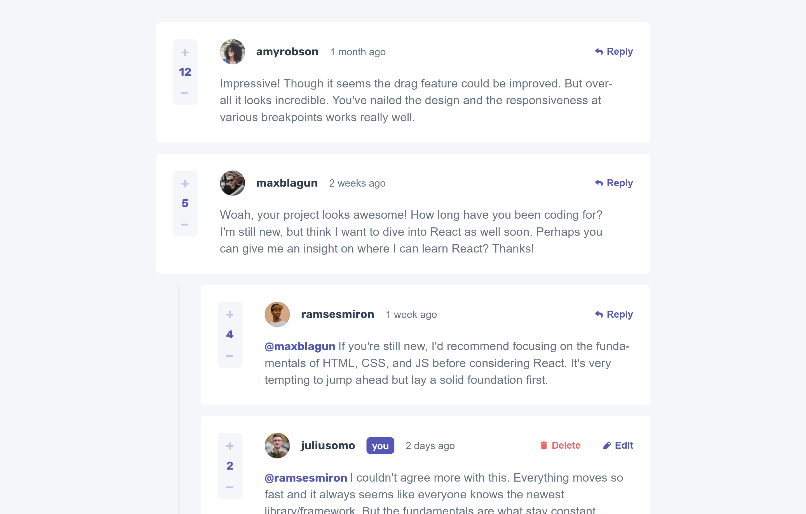

# Frontend Mentor - Interactive comments section solution

This is a solution to the [Interactive comments section challenge on Frontend Mentor](https://www.frontendmentor.io/challenges/interactive-comments-section-iG1RugEG9). Frontend Mentor challenges help you improve your coding skills by building realistic projects.

## Table of contents

-   [Overview](#overview)
    -   [The challenge](#the-challenge)
    -   [Screenshot](#screenshot)
    -   [Links](#links)
-   [My process](#my-process)
    -   [Built with](#built-with)
    -   [What I learned](#what-i-learned)
    -   [Useful resources](#useful-resources)
-   [Author](#author)

## Overview

### The challenge

Users should be able to:

-   View the optimal layout for the app depending on their device's screen size
-   See hover states for all interactive elements on the page
-   Create, Read, Update, and Delete comments and replies
-   Upvote and downvote comments
-   **Bonus**: If you're building a purely front-end project, use `localStorage` to save the current state in the browser that persists when the browser is refreshed.
-   **Bonus**: Instead of using the `createdAt` strings from the `data.json` file, try using timestamps and dynamically track the time since the comment or reply was posted.

### Screenshot

### Links

-   Solution URL: [GitHub Repository](https://github.com/ozzy1136/interactive-comments-section)
-   Live Site URL: [Deployment on Vercel](https://interactive-comments-section-ozmarmen.vercel.app/)

## My process

### Built with

-   Semantic HTML5 markup
-   Mobile-first workflow
-   [React](https://reactjs.org/) - JS library
-   [Next.js](https://nextjs.org/) - React framework
-   [Immer](https://immerjs.github.io/immer/) - JS package to create immutable state
-   [react-a11y-dialog](https://github.com/KittyGiraudel/react-a11y-dialog) - React dialog component

### What I learned

The complexities of recursion! And how complicated it can be to update deeply nested state in React. Due to those complexities, the Immer package was necessary for passing immutable state to the function that updates the comments data. Still, I needed a way to access the replies array that the comment that is being updated belongs to. After some evenings struggling to find a solution on my own and on the Internet, I finally stumbled across the article I have listed in [Useful resources](#useful-resources) and was able to add the necessary logic for updating the comments.

### Useful resources

-   [Article by @wordsofteekay](https://www.iamtk.co/series/crafting-frontend/nested-comments) - I struggled so much to find a way to update state for nested replies until I read this article. I ultimately didn't use the exact solution, becuase the components weren't rerendering with the updated comments data. However, it gave me a useful perspective of accessing the replies array that I needed to update.

## Author

-   Website - [Ozmar Mendoza](https://ozzy1136.github.io/)
-   Frontend Mentor - [@ozzy1136](https://www.frontendmentor.io/profile/ozzy1136)
-   Twitter - [@11_crack](https://www.twitter.com/11_crack)
